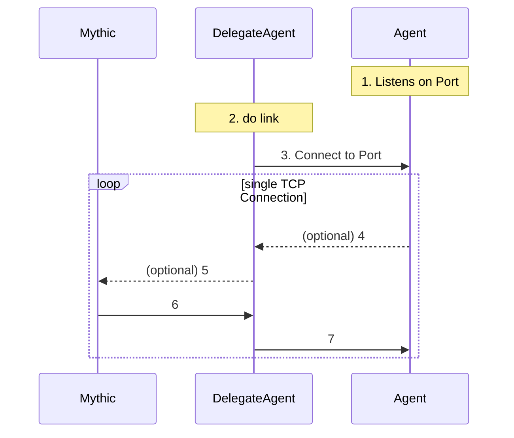

# Mythic P2P C2

A simple P2P profile for Mythic Agents.

In order to use it, another Agent needs to `link` to the Agent using it.

## Websockets C2 Workflow

4. The Agent sends data for Mythic to DelegateAgent
5. DelegateAgent forwards the whole message as part of his messages to mythic
6. Mythic knows that Agent can be reached via DelegateAgent and sends the data to DelegateAgent
7. DelegateAgent forwards the encrypted message to the Agent

The actual messages exchanged over TCP (4 & 7) are the ones Mythic uses internally (`b64(uuid+aes(json))`).
Messages will be pushed to the Agent from Mythic if the DelegateAgent allows it (
[get_delegate_tasks=True](https://docs.mythic-c2.net/customizing/c2-related-development/c2-profile-code/agent-side-coding/delegates)), which is why the steps 4 & 5 are optional as long as the Agent does not have anything to report back.

## How to install an agent in this format within Mythic

Use mythic-cli to install it:
`sudo ./mythic-cli install github https://github.com/MythicC2Profiles/tcp.git`

See https://docs.mythic-c2.net/installation#installing-agents-c2-profiles for more information
